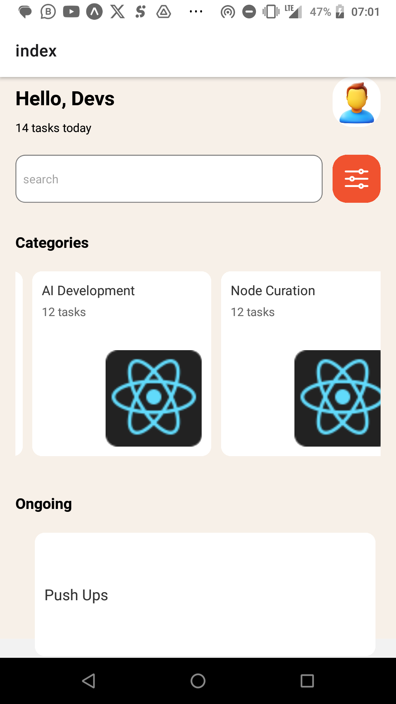

# DCIT202 Assignment 3

This project is based on creating an UI for an app that focuses on organization, and also provides a list of the ongoing tasks. It also has a search component that allows you to search for items.

- ScrollView
	Used the ScrollView Component to create an horizontal scroll for the category items. Chose this over FlatList because it had fewer items to display

- FlatList
	Used FlatList component to create the Ongoing Task list. This component was preferred due to the excess amount of tasks being listed.

- TextInput
	Used this for the search bar. Allows user to input text. Backend contains short code to search.

- View
	Used to display components and apply styles

- StyleSheet
	Custom styles for the components added. 

- TouchableOpacity
	Makes items in the category text touchable or gives visual feedback to user when an Item is touched.

- Image 
	Used to display images in the UI

- Text
	Renders text out. 
	
## Authors

- Nathan Attoh - 11357227

## Screenshots

